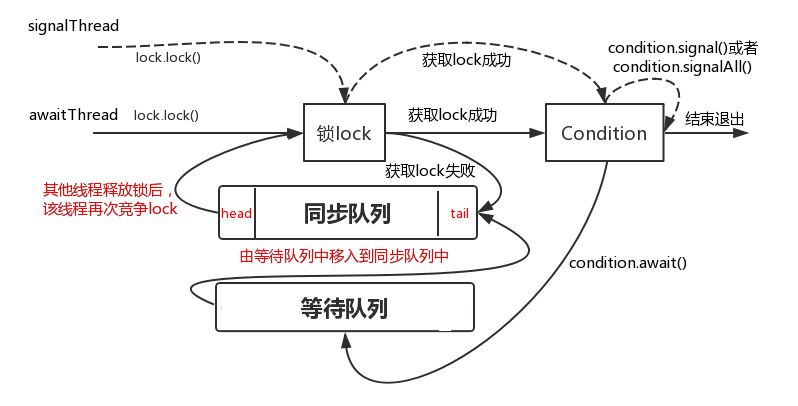

# Lock 体系

## Condition 条件对象

条件对象是**线程同步对象中的一种**，主要用来等待某种条件的发生，条件发生后，可以唤醒等待在该条件上的一个线程或者所有线程。

**条件对象要与锁一起协同工作**。通过 ReentrantLock 的 newCondtion 获取实例对象。

```java
ReentrantLock lock = new ReentrantLock();
Condition condition = lock.newCondition();
```


注意：

- Condition 中有 await、signal、signalAll ，分别对应 Object 中放入 wait、notify、notifyAll 方法，其实 Condition 也有上述三种方法，改变方法名称是为了避免使用上语义的混淆。

  await 和 signal / signalAll 方法就像一个开关控制着线程 A（等待方）和线程 B（通知方）。

  

  线程 awaitThread 先通过 lock.lock() 方法获取锁成功后调用了 condition.await 方法进入**等待队列**， 

  另一个线程 signalThread 通过 lock.lock() 方法获取锁成功后调用了 **condition.signal / signalAll， 使得线程 awaitThread 能够有机会移入到同步队列**中， 当其他线程释放 Lock 后使得线程 awaitThread 能够有机会获取 Lock， 从而使得线程 awaitThread 能够从 await 方法中退出，然后执行后续操作。 如果 awaitThread 获取 Lock 失败会直接进入到同步队列。

- 一个 Lock 可以与多个 Condition 对象绑定。

## AQS

AQS(AbtsractQueueSynchronized) 即同步队列器。

AQS 是一个抽象类，本身并没有实现任何同步接口的，只是通过提供**同步状态的获取和释放**来供自定义的同步组件使用。

AQS 的实现依赖内部的双向队列（底层是双向链表）。

如果当前线程获取同步状态失败，则会将该线程以及等待状态等信息封装为 Node，将其**加入同步队列的尾部，同时阻塞当前线程**，当同步状态释放时，唤醒队列的头结点。

```java
private transient volatile Node head; //同步队列的头结点
private transient volatile Node tail; //同步队列的尾结点
private volatile int state; //同步状态。
// state=0,表示同步状态可用；state=1，表示同步状态已被占用
```

## 可重入

某个线程试图获取一个已经有该线程持有的锁，那么这个请求就会成功。“重入”意味着获取的锁的操作的粒度是“线程”而不是“调用”。重入的一种实现方法是，为每个锁关联一个**计数器**（方便解锁）和一个**所有者线程**（知道是哪个线程是可重入的）。

## 公平锁与非公平锁

公平锁是指多个线程在等待同一个锁时，**按照申请锁的顺序来依次获取锁**。

|                            公平锁                            |                           非公平锁                           |
| :----------------------------------------------------------: | :----------------------------------------------------------: |
| 公平锁每次获取到锁为同步队列中的第一个节点，<br>保证请求资源时间上的绝对顺序 | 非公平锁有可能刚释放锁的线程下次继续获取该锁，<br>则有可能导致其他线程永远无法获取到锁，造成“饥饿”现象。 |
|   公平锁为了保证时间上的绝对顺序，<br>需要频繁的上下文切换   | 非公平锁会**降低一定的上下文切换**，降低性能开销<br>因此，ReentrantLock 默认选择的是非公平锁 |

## 独占锁和共享锁

独占锁模式下，每次只能有一个线程能持有锁，ReentrantLock 就是以独占方式实现的互斥锁。

共享锁，则允许多个线程同时获取锁，并发访问共享资源，如：ReadWriteLock。

很显然，独占锁是一种悲观保守的加锁策略，它避免了读/读冲突，如果某个只读线程获取锁，则其他读线程都只能等待，这种情况下就限制了不必要的并发性，因为读操作并不会影响数据的一致性。

共享锁则是一种乐观锁，它放宽了加锁策略，允许多个执行读操作的线程同时访问共享资源。

## ReentrantLock

ReentrantLock 即可重入锁，有 3 个内部类：Sync、FairSync 和 NonfairSync。

```java
abstract static class Sync extends AbstractQueuedSynchronizer {
    //...
}

static final class FairSync extends Sync {
    //...
}

static final class NonfairSync extends Sync {
    //...
}
```

- Sync 是一个继承 AQS 的抽象类，并发控制就是通过 Sync 实现的。

  重写了 tryRelease() , 有两个子类 FiarSync 和 NonfairSync，即公平锁和非公平锁。

- 由于 Sync 重写 tryRealese()  方法，并且 FairSync 和 NonfairSync没有再次重写该方法，所以 **公平锁和非公平锁释放锁的操作是一样的**，即**唤醒等待队列中第一个被挂起的线程**。

- 公平锁和非公平锁获取锁的方式是不同的。

  公平锁获取锁时，如果一个线程已经获取了锁，其他线程都会被挂起进入等待队列，后面来的**线程等待的时间**没有等待队列中线程等待的时间长的话，那么就会放弃获取锁，直接进入等待队列；

  非公平锁获取锁的方式是一种**抢占式**的，不考虑线程等待时间，无论是哪个线程获取了锁，则其他线程就进入等待队列。

```java
private final Sync sync;

public ReentrantLock() { //默认是非公平锁
    sync = new NonfairSync();
}

public ReentrantLock(boolean fair) { //可设置为公平锁
    sync = fair ? new FairSync() : new NonfairSync();
}
```

## ReentrantLock 与 synchronized 的区别

- **锁的实现**：

  synchronized 是 JVM 实现的，ReentrantLock 是 JDK 实现的。 

- **性能**：

  JDK1.6 后对 synchronized 进行了很多优化，两者的性能大致相同。

- **等待可中断**：

  当持有锁的线程长期未释放锁时，正在等待的线程可选择放弃等待，改为处理其他事情。

  ReentrantLock 是等待可中断的，synchronized  则不行。

- **公平锁**：

  公平锁是指多个线程在等待同一个锁时，**按照申请锁的顺序来依次获取锁**。

  synchronized 默认是非公平锁，ReentrantLock 既可以是公平锁，又可以是非公平锁。

- **锁绑定多个条件**：

  一个 ReentrantLock 可以绑定多个 Condition 对象。

## LockSupport

LockSupport 位于 java.util.concurrent.locks 包下。 LockSupprot 是线程的**阻塞原语**，用来**阻塞线程**和**唤醒线程**。 

每个使用 LockSupport 的线程都会与一个许可关联， 

如果该许可可用，并且可在线程中使用，则调用 park() 将会立即返回，否则可能阻塞。 

如果许可尚不可用，则可以调用 unpark 使其可用。 

但是注意**许可不可重入**，也就是说只能调用一次 park() 方法，否则会一直阻塞。

### LockSupport 中方法

|                     方法                      |                             说明                             |
| :-------------------------------------------: | :----------------------------------------------------------: |
|                  void park()                  | 阻塞当前线程，如果调用 unpark() 方法或者当前线程被中断， 能从 park()方法中返回 |
|           void park(Object blocker)           | 功能同park()，入参增加一个Object对象，用来记录导致线程阻塞的阻塞对象，方便进行问题排查 |
|          void parkNanos(long nanos)           |   阻塞当前线程，最长不超过nanos纳秒，增加了超时返回的特性    |
|  void parkNanos(Object blocker, long nanos)   | 功能同 parkNanos(long nanos)，入参增加一个 Object 对象，用来记录导致线程阻塞的阻塞对象，方便进行问题排查 |
|         void parkUntil(long deadline)         |                 阻塞当前线程，deadline 已知                  |
| void parkUntil(Object blocker, long deadline) | 功能同 parkUntil(long deadline)，入参增加一个 Object 对象，用来记录导致线程阻塞的阻塞对象，方便进行问题排查 |
|          void unpark(Thread thread)           |                  唤醒处于阻塞状态的指定线程                  |

实际上 LockSupport 阻塞和唤醒线程的功能是**依赖于 sun.misc.Unsafe**，比如 park() 方法的功能实现则是靠unsafe.park() 方法。 另外在阻塞线程这一系列方法中还有一个很有意思的现象：每个方法都会新增一个带有Object 的阻塞对象的重载方法。 那么增加了一个 Object 对象的入参会有什么不同的地方了？

- 调用 park() 方法 dump 线程：

```
"main" #1 prio=5 os_prio=0 tid=0x02cdcc00 nid=0x2b48 waiting on condition [0x00d6f000]
   java.lang.Thread.State: WAITING (parking)
        at sun.misc.Unsafe.park(Native Method)
        at java.util.concurrent.locks.LockSupport.park(LockSupport.java:304)
        at learn.LockSupportDemo.main(LockSupportDemo.java:7)
Copy to clipboardErrorCopied
```

- 调用 park(Object blocker) 方法 dump 线程:

```java
"main" #1 prio=5 os_prio=0 tid=0x0069cc00 nid=0x6c0 waiting on condition [0x00dcf000]
   java.lang.Thread.State: WAITING (parking)
        at sun.misc.Unsafe.park(Native Method)
        - parking to wait for  <0x048c2d18> (a java.lang.String)
        at java.util.concurrent.locks.LockSupport.park(LockSupport.java:175)
        at learn.LockSupportDemo.main(LockSupportDemo.java:7)Copy to clipboardErrorCopied
```

通过分别调用这两个方法然后 dump 线程信息可以看出， 带 Object 的 park 方法相较于无参的 park 方法会增加

```java
- parking to wait for  <0x048c2d18> (a java.lang.String)Copy to clipboardErrorCopied
```

这种信息就类似于记录“案发现场”，有助于工程人员能够迅速发现问题解决问题。

注意：

- synchronized 使线程阻塞，线程会进入到 BLOCKED 状态
- 调用 LockSupprt 方法阻塞线程会使线程进入到 WAITING 状态

### LockSupport 使用示例

```java
import java.util.concurrent.locks.LockSupport;

public class LockSupportExample {
    public static void main(String[] args) {
        Thread t1 = new Thread(() -> {
            LockSupport.park();
            System.out.println(Thread.currentThread().getName() + "被唤醒");
        });
        Thread t2 = new Thread(() -> {
            LockSupport.park();
            System.out.println(Thread.currentThread().getName() + "被唤醒");
        });
        t1.start();
        t2.start();
        try {
            Thread.sleep(3000);
        } catch (InterruptedException e) {
            e.printStackTrace();
        }
        LockSupport.unpark(t1);
        LockSupport.unpark(t2);
    }
}
```

```html
Thread-0被唤醒
Thread-1被唤醒
```

t1 线程调用 LockSupport.park() 使 t1 阻塞， 当 mian 线程睡眠 3 秒结束后通过 LockSupport.unpark(t1)方法唤醒 t1 线程，t1 线程被唤醒执行后续操作。 另外，还有一点值得关注的是，LockSupport.unpark(t1)可以**通过指定线程对象唤醒指定的线程**。
